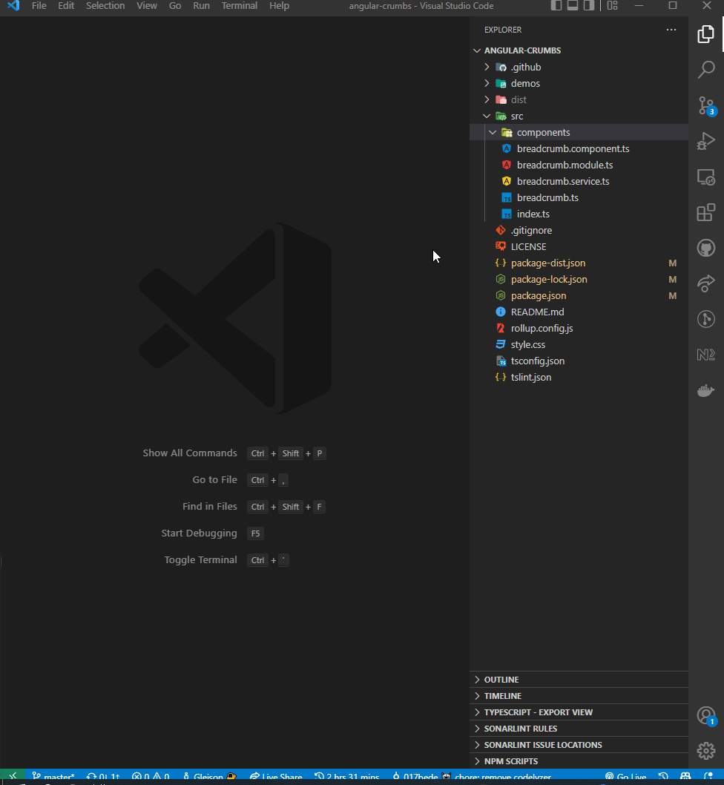

███╗░░██╗░██████╗░██╗░░██╗░░░░░░██████╗░███████╗██╗░░░██╗░██████╗
████╗░██║██╔════╝░╚██╗██╔╝░░░░░░██╔══██╗██╔════╝██║░░░██║██╔════╝
██╔██╗██║██║░░██╗░░╚███╔╝░█████╗██║░░██║█████╗░░╚██╗░██╔╝╚█████╗░
██║╚████║██║░░╚██╗░██╔██╗░╚════╝██║░░██║██╔══╝░░░╚████╔╝░░╚═══██╗
██║░╚███║╚██████╔╝██╔╝╚██╗░░░░░░██████╔╝███████╗░░╚██╔╝░░██████╔╝
╚═╝░░╚══╝░╚═════╝░╚═╝░░╚═╝░░░░░░╚═════╝░╚══════╝░░░╚═╝░░░╚═════╝░

# The UI for Ngxd CLI

**Spend less time looking up command line arguments and more time shipping incredible products.**

## Download

You can install the [Nx Console Visual Studio Code Plugin](https://marketplace.visualstudio.com/items?itemName=nrwl.ngxd-console) from the Visual Studio Marketplace.
